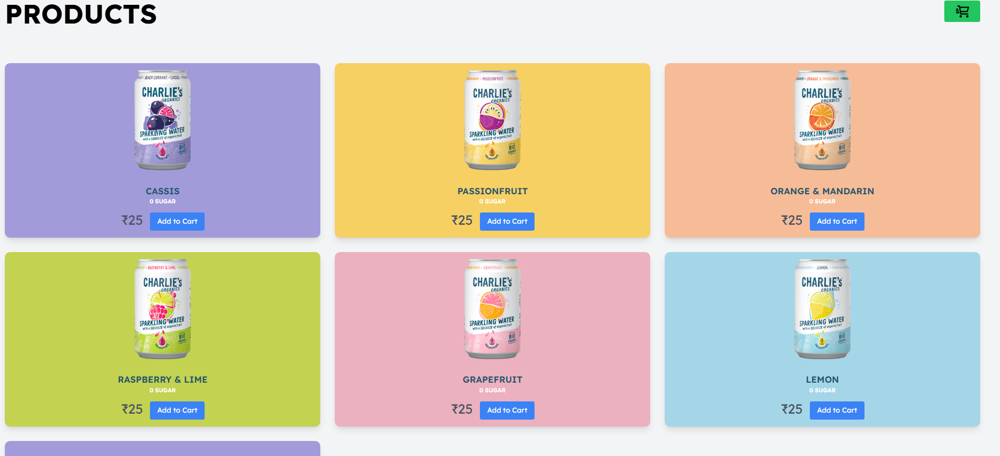
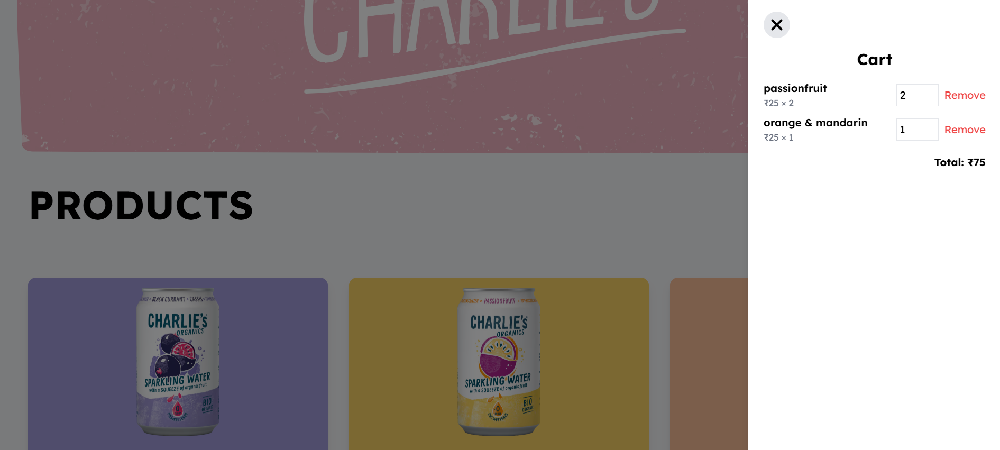

# 🛍️ Cart & Product Frontend (React)

A user-friendly interface to browse products, add items to cart, update quantity, remove items, and view the dynamic total – all with a responsive design.

## ✨ Features

- Browse and display products with vibrant backgrounds
- Add products to cart
- View cart in a right-side modal with backdrop
- Update item quantities
- Remove items from the cart
- Live total price calculation
- Persistent cart via backend (NestJS + MongoDB)

## 🧰 Tech Stack

| Technology | Description                    |
|------------|--------------------------------|
| React      | UI library for building the frontend |
| Tailwind CSS | Utility-first CSS framework |
| Axios      | HTTP client to call backend APIs |

## 📸 Screenshots

### 🛒 Product List Page




### 🧺 Cart Modal



## 🚀 Getting Started

### Prerequisites

- Node.js version 18.18
- npm or yarn

### Install and Run

```bash
cd frontend
npm install
npm start
