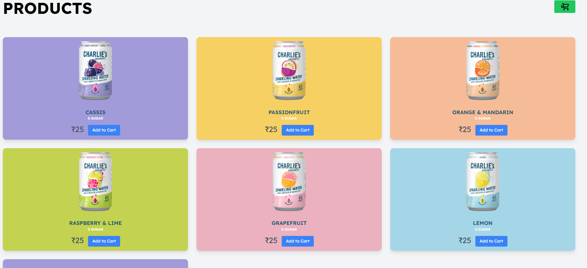
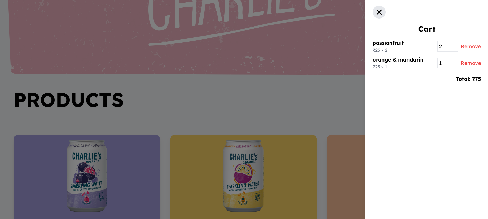

# 🛍️ Fullstack Cart System – React + NestJS + MongoDB

A modern cart and product management web application built with NestJS (Backend), MongoDB (Database), and React with Tailwind CSS (Frontend).

---

## ✨ Features

* Add, remove, and update products in the cart
* Dynamic cart total calculation
* Cart displayed in a side modal with a backdrop
* Backend persistence using MongoDB
* Product CRUD management
* Responsive UI with animated interactions

---

## 🧰 Tech Stack

### 🗅️ Frontend

| Technology   | Purpose                   |
| ------------ | ------------------------- |
| React        | UI Framework              |
| Tailwind CSS | Styling                   |
| Axios        | API calls to backend      |

### ⚙️ Backend

| Technology | Purpose                   |
| ---------- | ------------------------- |
| NestJS     | Server-side framework     |
| TypeScript | Static typing             |
| MongoDB    | NoSQL database            |
| Mongoose   | MongoDB ODM               |
| Express.js | Underlying HTTP framework |
| CORS       | Middleware for frontend   |

---

## 📸 Screenshots


### Product List Page




### Cart Modal with Backdrop



---

## 💪 Getting Started

### 📁 Project Structure

```
project-root/
├── backend/      # NestJS + MongoDB server
│   ├── src/
│   ├── package.json
│   └── README.md
├── frontend/     # React + Tailwind UI
│   ├── src/
│   └── README.md
└── README.md     # This file
```

---

## 🚀 Setup Instructions

### Prerequisites

- Node.js Version used 18.18
- MongoDB running locally or remotely
- Find Data dump and Postman collection in the Database Dump folder
- Import postman Collection in postman and data in mongodb

### 1. Clone the repository

```bash
git clone <your-repo-url>
cd project-root
```

---

### 2. Start Backend

```bash
cd Backend/cart-system-backend
npm install
npm run start
```

> By default, runs on `http://localhost:3000`

📌 **Ensure MongoDB is running locally** (or update URI in `app.module.ts`)
MongooseModule.forRoot('mongodb://localhost:27017/cart-db')

---

### 3. Start Frontend

```bash
cd frontend
npm install
npm run dev
```

> Opens in browser at `http://localhost:3001`

Make sure backend is running first.

---

## 🔗 API Endpoints

### 📺 Cart

| Method | Endpoint                                          | Description              |
| ------ | ------------------------------------------------- | ------------------------ |
| GET    | `/cart?userId=002`                                | Get user’s cart          |
| POST   | `/cart/add?userId=002`                            | Add product to cart      |
| PATCH  | `/cart/update?userId=002&productId=p1&quantity=3` | Update quantity in cart  |
| DELETE | `/cart/remove?userId=002&productId=p1`            | Remove product from cart |

### 📦 Product

| Method | Endpoint        | Description        |
| ------ | --------------- | ------------------ |
| GET    | `/products`     | Get all products   |
| POST   | `/products`     | Create new product |
| PATCH  | `/products/:id` | Update product     |
| DELETE | `/products/:id` | Delete product     |

---

### Future Scope

- Adding animations through GSAP.
- Adding Authentication flow in both frontend and backend.
- Deployment on Cloud.

---
